# Fluxo do Sistema — Letrar IA

Da criação de uma tarefa para o aluno até a leitura, transcrição e insights de IA.

---

## Visão Geral

```mermaid
flowchart TD
    A([Profissional logado]) --> B

    subgraph TAREFA["1 — CRIAÇÃO DA TAREFA"]
        B[ProfessionalHome] --> C{Tipo de tarefa}
        C -->|Atividade estruturada| D["POST /activities/\n(título, tipo, dificuldade,\ndata, palavras-foco, alunos)"]
        C -->|Trilha de leitura| E["GET /trails/\n(filtro por idade do aluno)"]
        C -->|Texto avulso| F["POST /text-library/\n(título, conteúdo, foco de letras,\nassigned_student_ids)"]
        D --> G[(Activity + StudentActivity\nem PostgreSQL)]
        E --> H[(Trail + TrailStory\nem PostgreSQL)]
        F --> I[(TextLibrary\nem PostgreSQL)]
    end

    subgraph LEITURA["2 — LEITURA PELO ALUNO"]
        G & H & I --> J[ReadingTrail\nCarrossel de histórias]
        J --> K[Aluno seleciona história/texto]
        K --> L[ReadingStory\nexibe conteúdo para leitura em voz alta]
        L --> M[Browser captura áudio\nMediaRecorder API]
        M --> N["POST /recordings/\n(audio_file + student_id\n+ story_id / text_id / activity_id\n+ duration_seconds)"]
    end

    subgraph TRANSCRICAO["3 — TRANSCRIÇÃO (Whisper)"]
        N --> O[RecordingService\nsalva áudio no MinIO]
        O --> P["WhisperService\n.transcribe_bytes(audio, lang='pt')"]
        P --> Q[Transcrição em texto\nretornada ao serviço]
    end

    subgraph ANALISE["4 — ANÁLISE DE LEITURA"]
        Q --> R["analyze_reading()\ntranscrição vs texto de referência"]
        R --> S["Métricas calculadas\n• Fluência (0-100)\n• Prosódia (0-100)\n• Velocidade (PPM/WPM)\n• Acurácia (%)\n• Score geral\n• Erros detectados\n• Pontos de melhoria"]
        S --> T[(RecordingAnalysis\nupsert no PostgreSQL)]
    end

    subgraph INSIGHTS["5 — INSIGHTS DE IA"]
        T --> U{GeminiService\ndisponível?}
        U -->|Sim| V["GeminiService\n.generate_recording_insight()\n(análise contextual via LLM)"]
        U -->|Não / Fallback| W["_build_analysis_insight_payload()\n(lógica baseada em regras)"]
        V & W --> X{Classificação do insight}
        X -->|Acurácia ≥ 85% e ≤ 1 erro| Y["tipo: progress\nprioridade: low\n'Leitura com excelente acurácia'"]
        X -->|Acurácia < 60% ou ≥ 5 erros| Z["tipo: attention_needed\nprioridade: high\n'Atenção necessária'"]
        X -->|Demais casos| AA["tipo: suggestion\nprioridade: medium\n'Sugestão de melhoria'"]
        Y & Z & AA --> AB[(AIInsight\nem PostgreSQL)]
    end

    subgraph REVISAO["6 — REVISÃO PELO PROFISSIONAL"]
        AB --> AC[ProfessionalHome\nDashboard com badges de insights]
        AC --> AD["GET /recordings/{id}/metrics\nRetorna:"]
        AD --> AE["• Transcrição completa\n• Fluência, Prosódia, Acurácia, PPM\n• Score geral\n• Erros detectados\n• Pontos de melhoria\n• Insights de IA com prioridade"]
        AE --> AF[RecordingsList\nexibe análise e áudio]
        AF --> AG["StudentTracking\nHistórico: tendência de PPM,\nacurácia média, attention_points"]
    end

    TAREFA --> LEITURA
    LEITURA --> TRANSCRICAO
    TRANSCRICAO --> ANALISE
    ANALISE --> INSIGHTS
    INSIGHTS --> REVISAO
```



---

## Detalhamento por Etapa

### 1 — Criação da Tarefa

| Ação | Endpoint | Entidade criada |
|------|----------|-----------------|
| Criar atividade e atribuir a alunos | `POST /activities/` | `Activity` + `StudentActivity` |
| Selecionar trilha existente | `GET /trails/?age_range=...` | — (leitura) |
| Criar/atribuir texto da biblioteca | `POST /text-library/` | `TextLibrary` |

O profissional acessa a tela **ProfessionalHome**, escolhe um ou mais alunos e define o conteúdo a ser lido.

---

### 2 — Leitura pelo Aluno

O componente **ReadingTrail** exibe um carrossel com as histórias da trilha e textos da biblioteca atribuídos ao aluno. Ao iniciar, **ReadingStory** renderiza o texto e ativa o `MediaRecorder` do browser para captura de áudio.

O áudio gravado é enviado via `POST /recordings/` junto com os metadados da sessão.

---

### 3 — Transcrição com Whisper

```
RecordingService.create_recording()
  └─ save_audio_file()          → MinIO (S3-compatible)
  └─ WhisperService
       .transcribe_bytes(audio)  → modelo Whisper local, idioma PT
       retorna: string com transcrição
```

O **WhisperService** executa a transcrição em uma thread separada (executor) para não bloquear o event loop assíncrono.

---

### 4 — Análise de Leitura

```
analyze_reading(transcription, reference_text)
  ├─ fluency_score      → fluidez da leitura (0–100)
  ├─ prosody_score      → entonação e ênfase (0–100)
  ├─ speed_wpm          → palavras por minuto
  ├─ accuracy_score     → % de palavras corretas
  ├─ overall_score      → média ponderada
  ├─ errors_detected    → lista de palavras erradas
  └─ improvement_points → áreas de foco
```

Resultado persistido em `RecordingAnalysis` (relação 1:1 com `Recording`).

---

### 5 — Geração de Insights de IA

**Fluxo primário (Gemini):**
```
GeminiService.generate_recording_insight(recording, analysis, student)
  → chamada LLM com contexto completo
  → retorna insight contextualizado
```

**Fallback (regras):**
```python
if accuracy >= 85 and errors <= 1:
    tipo = "progress",          prioridade = "low"
elif accuracy < 60 or errors >= 5:
    tipo = "attention_needed",  prioridade = "high"
else:
    tipo = "suggestion",        prioridade = "medium"

título = f"Acurácia {accuracy}% · PPM {speed_wpm}"
```

Insight salvo em `AIInsight` com `related_students` (array JSONB) e `professional_id`.

---

### 6 — Revisão pelo Profissional

```
GET /recordings/{recording_id}/metrics
→ {
    transcription,
    fluency_score, prosody_score, accuracy_percentage, speed_wpm,
    overall_score, errors_count, correct_words_count, total_words,
    improvement_points: [...],
    insights: [{ title, description, type, priority, created_at }]
  }
```

O profissional visualiza:
- **RecordingsList** — transcrição + métricas + playback do áudio (presigned URL MinIO, validade 1h)
- **StudentTracking** — histórico de PPM, acurácia média, attention_points ao longo do tempo
- **Dashboard** — badges de insights não lidos agrupados por prioridade

---

## Modelo de Dados Simplificado

```
users
 └─ students (professional_id)
     └─ student_activities (student_id)
     │   └─ activities (activity_id)
     └─ recordings (student_id)
         ├─ story_id  → trail_stories → trails
         ├─ text_id   → text_library
         ├─ activity_id → activities
         ├─ recording_analysis (1:1)
         └─ ai_insights (related_students[])
```

---

## Tecnologias por Camada

| Camada | Tecnologia |
|--------|-----------|
| Frontend | React + TypeScript + Vite |
| API | FastAPI (Python) |
| Banco de dados | PostgreSQL (SQLAlchemy ORM) |
| Armazenamento de áudio | MinIO (S3-compatible) |
| Transcrição | OpenAI Whisper (local) |
| Insights LLM | Google Gemini API (com fallback por regras) |
| Autenticação | Bearer Token + Refresh Token |
| Infraestrutura | Docker Compose |
