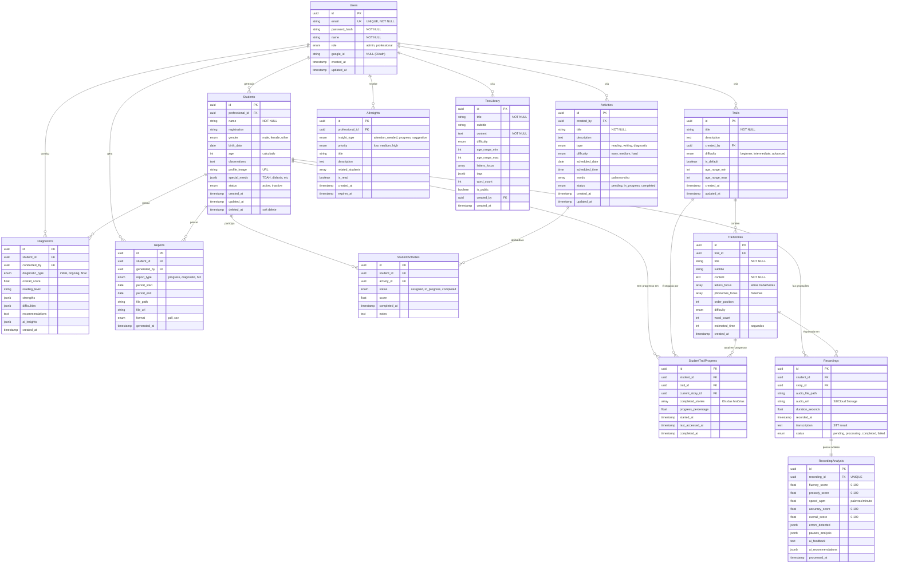

# Modelo de Banco de Dados - Letrar IA

## Sumário
- [Visão Geral](#visão-geral)
- [Diagrama ER (Mermaid)](#diagrama-er-mermaid)
- [Tecnologias](#tecnologias)
- [Entidades Detalhadas](#entidades-detalhadas)
- [Relacionamentos](#relacionamentos)
- [Notas de Implementação](#notas-de-implementação)
- [Próximos Passos](#próximos-passos)

---

## Visão Geral

Este documento descreve o modelo de dados da plataforma **Letrar IA**, uma aplicação de alfabetização inteligente que utiliza IA para análise de leitura e acompanhamento pedagógico.

### Estatísticas do Modelo
- **Total de Tabelas**: 13
- **Relacionamentos**: 15+
- **Histórias de Usuário Cobertas**: HU1-HU9
- **Suporte a**: Gravações de áudio, análise de IA, trilhas personalizadas, relatórios

---

## Diagrama ER (Mermaid)



---

## Tecnologias

### Backend
- **Linguagem**: Python 3.11+
- **Framework**: FastAPI 0.104+
- **ORM**: SQLAlchemy 2.x (Async)
- **Migrations**: Alembic
- **Validação**: Pydantic V2

### Banco de Dados
- **SGBD**: PostgreSQL 15+
- **Extensões**:
  - `uuid-ossp` (geração de UUIDs)
  - `pg_trgm` (busca full-text)
  - `btree_gin` (índices compostos)

---

## Entidades Detalhadas

### 1. **Users** (Professores e Administradores)

Armazena informações dos usuários do sistema (professores e admins).

| Campo | Tipo | Descrição | Constraints |
|-------|------|-----------|-------------|
| `id` | UUID | Identificador único | PK |
| `email` | VARCHAR(255) | Email do usuário | UNIQUE, NOT NULL |
| `password_hash` | VARCHAR(255) | Senha hasheada (bcrypt) | NOT NULL |
| `name` | VARCHAR(255) | Nome completo | NOT NULL |
| `role` | ENUM | Tipo: `admin`, `professional` | NOT NULL |
| `google_id` | VARCHAR(255) | ID OAuth Google | NULL, UNIQUE |
| `created_at` | TIMESTAMP | Data de criação | DEFAULT NOW() |
| `updated_at` | TIMESTAMP | Última atualização | DEFAULT NOW() |

**HU Relacionadas**: HU8

---

### 2. **Students** (Alunos)

Dados dos alunos cadastrados por professores.

| Campo | Tipo | Descrição | Constraints |
|-------|------|-----------|-------------|
| `id` | UUID | Identificador único | PK |
| `professional_id` | UUID | Professor responsável | FK → users.id, NOT NULL |
| `name` | VARCHAR(255) | Nome completo | NOT NULL |
| `registration` | VARCHAR(50) | Matrícula escolar | NULL |
| `gender` | ENUM | `male`, `female`, `other` | NULL |
| `birth_date` | DATE | Data de nascimento | NULL |
| `age` | INT | Idade (calculada) | NULL |
| `observations` | TEXT | Observações gerais | NULL |
| `profile_image` | VARCHAR(500) | URL da foto | NULL |
| `special_needs` | JSONB | Condições especiais | NULL |
| `status` | ENUM | `active`, `inactive` | DEFAULT 'active' |
| `created_at` | TIMESTAMP | Data de cadastro | DEFAULT NOW() |
| `updated_at` | TIMESTAMP | Última atualização | DEFAULT NOW() |
| `deleted_at` | TIMESTAMP | Soft delete | NULL |

**Exemplo de `special_needs`**:
```json
{
  "tdah": true,
  "dislexia": false,
  "outras": "Dificuldade de concentração"
}
```

**HU Relacionadas**: HU1, HU4

---

### 3. **Trails** (Trilhas de Leitura)

Trilhas de leitura personalizáveis ou padrão.

| Campo | Tipo | Descrição | Constraints |
|-------|------|-----------|-------------|
| `id` | UUID | Identificador único | PK |
| `title` | VARCHAR(255) | Título da trilha | NOT NULL |
| `description` | TEXT | Descrição | NULL |
| `created_by` | UUID | Criador | FK → users.id |
| `difficulty` | ENUM | `beginner`, `intermediate`, `advanced` | NOT NULL |
| `is_default` | BOOLEAN | Trilha padrão do sistema | DEFAULT false |
| `age_range_min` | INT | Idade mínima recomendada | NULL |
| `age_range_max` | INT | Idade máxima recomendada | NULL |
| `created_at` | TIMESTAMP | Data de criação | DEFAULT NOW() |
| `updated_at` | TIMESTAMP | Última atualização | DEFAULT NOW() |

**HU Relacionadas**: HU2, HU7

---

### 4. **TrailStories** (Histórias da Trilha)

Textos/histórias que compõem uma trilha.

| Campo | Tipo | Descrição | Constraints |
|-------|------|-----------|-------------|
| `id` | UUID | Identificador único | PK |
| `trail_id` | UUID | Trilha pertencente | FK → trails.id, NOT NULL |
| `title` | VARCHAR(255) | Título do texto | NOT NULL |
| `subtitle` | VARCHAR(255) | Subtítulo (letras) | NULL |
| `content` | TEXT | Conteúdo completo | NOT NULL |
| `letters_focus` | VARCHAR[] | Letras trabalhadas | NULL |
| `phonemes_focus` | VARCHAR[] | Fonemas trabalhados | NULL |
| `order_position` | INT | Ordem na trilha | NOT NULL |
| `difficulty` | ENUM | Nível de dificuldade | NULL |
| `word_count` | INT | Número de palavras | NULL |
| `estimated_time` | INT | Tempo estimado (seg) | NULL |
| `created_at` | TIMESTAMP | Data de criação | DEFAULT NOW() |

**HU Relacionadas**: HU2, HU7

---

### 5. **StudentTrailProgress** (Progresso na Trilha)

Acompanhamento do progresso de cada aluno em uma trilha.

| Campo | Tipo | Descrição | Constraints |
|-------|------|-----------|-------------|
| `id` | UUID | Identificador único | PK |
| `student_id` | UUID | Aluno | FK → students.id, NOT NULL |
| `trail_id` | UUID | Trilha | FK → trails.id, NOT NULL |
| `current_story_id` | UUID | História atual | FK → trail_stories.id, NULL |
| `completed_stories` | INT[] | IDs das histórias completas | DEFAULT '{}' |
| `progress_percentage` | FLOAT | Percentual de conclusão | DEFAULT 0 |
| `started_at` | TIMESTAMP | Início | DEFAULT NOW() |
| `last_accessed_at` | TIMESTAMP | Último acesso | DEFAULT NOW() |
| `completed_at` | TIMESTAMP | Conclusão | NULL |

**HU Relacionadas**: HU2, HU6

---

### 6. **Recordings** (Gravações de Áudio)

Gravações de leitura dos alunos.

| Campo | Tipo | Descrição | Constraints |
|-------|------|-----------|-------------|
| `id` | UUID | Identificador único | PK |
| `student_id` | UUID | Aluno | FK → students.id, NOT NULL |
| `story_id` | UUID | História lida | FK → trail_stories.id, NOT NULL |
| `audio_file_path` | VARCHAR(500) | Path local | NULL |
| `audio_url` | VARCHAR(500) | URL S3/Cloud | NULL |
| `duration_seconds` | FLOAT | Duração | NOT NULL |
| `recorded_at` | TIMESTAMP | Data/hora | DEFAULT NOW() |
| `transcription` | TEXT | Transcrição STT | NULL |
| `status` | ENUM | `pending`, `processing`, `completed`, `failed` | DEFAULT 'pending' |

**HU Relacionadas**: HU3, HU5

---

### 7. **RecordingAnalysis** (Análise de IA)

Resultado da análise de IA sobre as gravações.

| Campo | Tipo | Descrição | Constraints |
|-------|------|-----------|-------------|
| `id` | UUID | Identificador único | PK |
| `recording_id` | UUID | Gravação analisada | FK → recordings.id, UNIQUE |
| `fluency_score` | FLOAT | Fluência (0-100) | CHECK >= 0 AND <= 100 |
| `prosody_score` | FLOAT | Prosódia (0-100) | CHECK >= 0 AND <= 100 |
| `speed_wpm` | FLOAT | Velocidade (pal/min) | CHECK >= 0 |
| `accuracy_score` | FLOAT | Acurácia (0-100) | CHECK >= 0 AND <= 100 |
| `overall_score` | FLOAT | Nota geral (0-100) | CHECK >= 0 AND <= 100 |
| `errors_detected` | JSONB | Erros identificados | NULL |
| `pauses_analysis` | JSONB | Análise de pausas | NULL |
| `ai_feedback` | TEXT | Feedback textual | NULL |
| `ai_recommendations` | JSONB | Recomendações | NULL |
| `processed_at` | TIMESTAMP | Data processamento | DEFAULT NOW() |

**Exemplo de `errors_detected`**:
```json
[
  {
    "type": "pronunciation",
    "word": "rato",
    "expected": "RA-to",
    "detected": "HA-to",
    "position": 3,
    "severity": "medium"
  }
]
```

**Exemplo de `pauses_analysis`**:
```json
{
  "total_pauses": 8,
  "average_duration_ms": 1200,
  "inappropriate_pauses": 2,
  "pause_positions": [5, 12, 18, 25, 30, 35, 40, 45]
}
```

**HU Relacionadas**: HU5

---

### 8. **Diagnostics** (Diagnósticos)

Diagnósticos pedagógicos dos alunos.

| Campo | Tipo | Descrição | Constraints |
|-------|------|-----------|-------------|
| `id` | UUID | Identificador único | PK |
| `student_id` | UUID | Aluno avaliado | FK → students.id, NOT NULL |
| `conducted_by` | UUID | Professor avaliador | FK → users.id, NOT NULL |
| `diagnostic_type` | ENUM | `initial`, `ongoing`, `final` | NOT NULL |
| `overall_score` | FLOAT | Nota geral (0-100) | NULL |
| `reading_level` | VARCHAR(50) | Nível de leitura | NULL |
| `strengths` | JSONB | Pontos fortes | NULL |
| `difficulties` | JSONB | Dificuldades | NULL |
| `recommendations` | TEXT | Recomendações | NULL |
| `ai_insights` | JSONB | Insights da IA | NULL |
| `created_at` | TIMESTAMP | Data de criação | DEFAULT NOW() |

**HU Relacionadas**: HU5

---

### 9. **Activities** (Atividades)

Atividades criadas pelos professores.

| Campo | Tipo | Descrição | Constraints |
|-------|------|-----------|-------------|
| `id` | UUID | Identificador único | PK |
| `created_by` | UUID | Professor criador | FK → users.id, NOT NULL |
| `title` | VARCHAR(255) | Título | NOT NULL |
| `description` | TEXT | Descrição | NULL |
| `type` | ENUM | `reading`, `writing`, `diagnostic` | NOT NULL |
| `difficulty` | ENUM | `easy`, `medium`, `hard` | NULL |
| `scheduled_date` | DATE | Data agendada | NULL |
| `scheduled_time` | TIME | Horário | NULL |
| `words` | VARCHAR[] | Palavras-alvo | NULL |
| `status` | ENUM | `pending`, `in_progress`, `completed` | DEFAULT 'pending' |
| `created_at` | TIMESTAMP | Data de criação | DEFAULT NOW() |
| `updated_at` | TIMESTAMP | Última atualização | DEFAULT NOW() |

**HU Relacionadas**: HU7

---

### 10. **StudentActivities** (Relação Aluno-Atividade)

Tabela de associação N:M entre alunos e atividades.

| Campo | Tipo | Descrição | Constraints |
|-------|------|-----------|-------------|
| `id` | UUID | Identificador único | PK |
| `student_id` | UUID | Aluno | FK → students.id, NOT NULL |
| `activity_id` | UUID | Atividade | FK → activities.id, NOT NULL |
| `status` | ENUM | `assigned`, `in_progress`, `completed` | DEFAULT 'assigned' |
| `score` | FLOAT | Pontuação | NULL |
| `completed_at` | TIMESTAMP | Data conclusão | NULL |
| `notes` | TEXT | Notas/observações | NULL |

---

### 11. **TextLibrary** (Biblioteca de Textos)

Biblioteca de textos disponíveis para uso.

| Campo | Tipo | Descrição | Constraints |
|-------|------|-----------|-------------|
| `id` | UUID | Identificador único | PK |
| `title` | VARCHAR(255) | Título | NOT NULL |
| `subtitle` | VARCHAR(255) | Subtítulo | NULL |
| `content` | TEXT | Conteúdo completo | NOT NULL |
| `difficulty` | ENUM | Nível | NOT NULL |
| `age_range_min` | INT | Idade mínima | NULL |
| `age_range_max` | INT | Idade máxima | NULL |
| `letters_focus` | VARCHAR[] | Letras trabalhadas | NULL |
| `tags` | JSONB | Tags organizacionais | NULL |
| `word_count` | INT | Número de palavras | NULL |
| `is_public` | BOOLEAN | Texto público | DEFAULT true |
| `created_by` | UUID | Criador | FK → users.id, NULL |
| `created_at` | TIMESTAMP | Data de criação | DEFAULT NOW() |

**HU Relacionadas**: HU7

---

### 12. **Reports** (Relatórios)

Relatórios gerados e exportados.

| Campo | Tipo | Descrição | Constraints |
|-------|------|-----------|-------------|
| `id` | UUID | Identificador único | PK |
| `student_id` | UUID | Aluno | FK → students.id, NOT NULL |
| `generated_by` | UUID | Gerador | FK → users.id, NOT NULL |
| `report_type` | ENUM | `progress`, `diagnostic`, `full` | NOT NULL |
| `period_start` | DATE | Início período | NULL |
| `period_end` | DATE | Fim período | NULL |
| `file_path` | VARCHAR(500) | Path local | NULL |
| `file_url` | VARCHAR(500) | URL do arquivo | NULL |
| `format` | ENUM | `pdf`, `csv` | NOT NULL |
| `generated_at` | TIMESTAMP | Data geração | DEFAULT NOW() |

**HU Relacionadas**: HU6, HU9

---

### 13. **AIInsights** (Insights de IA)

Insights e alertas gerados pela IA.

| Campo | Tipo | Descrição | Constraints |
|-------|------|-----------|-------------|
| `id` | UUID | Identificador único | PK |
| `professional_id` | UUID | Professor destinatário | FK → users.id, NOT NULL |
| `insight_type` | ENUM | `attention_needed`, `progress`, `suggestion` | NOT NULL |
| `priority` | ENUM | `low`, `medium`, `high` | DEFAULT 'medium' |
| `title` | VARCHAR(255) | Título | NOT NULL |
| `description` | TEXT | Descrição completa | NOT NULL |
| `related_students` | INT[] | IDs dos alunos | NULL |
| `is_read` | BOOLEAN | Foi lido | DEFAULT false |
| `created_at` | TIMESTAMP | Data de criação | DEFAULT NOW() |
| `expires_at` | TIMESTAMP | Expiração | NULL |

---

## Relacionamentos

### Resumo de Cardinalidades

| Tabela Origem | Relação | Tabela Destino | Tipo |
|---------------|---------|----------------|------|
| Users | 1:N | Students | Um professor gerencia N alunos |
| Users | 1:N | Trails | Um professor cria N trilhas |
| Users | 1:N | Activities | Um professor cria N atividades |
| Users | 1:N | Diagnostics | Um professor conduz N diagnósticos |
| Students | 1:N | Recordings | Um aluno faz N gravações |
| Students | N:M | Activities | N alunos fazem M atividades |
| Trails | 1:N | TrailStories | Uma trilha tem N histórias |
| TrailStories | 1:N | Recordings | Uma história é gravada N vezes |
| Recordings | 1:1 | RecordingAnalysis | Uma gravação tem 1 análise |
| Students | 1:N | StudentTrailProgress | Um aluno progride em N trilhas |

---

## Notas de Implementação

### UUIDs vs. Integers

**UUIDs escolhidos porque**:
- Segurança (não expõem quantidade de registros)
- Distribuição (podem ser gerados no cliente)
- Merge de dados de diferentes ambientes

### JSONB vs. Tabelas Normalizadas

**JSONB usado para**:
- `special_needs`: Dados flexíveis, raramente consultados
- `errors_detected`: Estrutura variável por tipo de erro
- `ai_recommendations`: Dados gerados dinamicamente
- `tags`: Metadados livres

**Tabelas separadas para**:
- Dados consultados frequentemente
- Relacionamentos complexos
- Integridade referencial crítica

### Soft Delete

Implementado em `students` para:
- Preservar histórico de gravações
- Permitir restauração
- Auditoria

---

